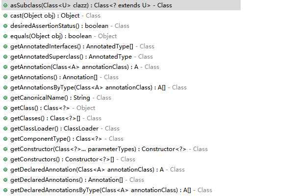

# 注解作用

注解（Annotation）是 Java 程序的一种`特殊“注释”`。它是==放在 Java 源码的类、方法、字段、参数前==的一种特殊“注释。==注释会被编译器直接忽略，注解则可以被编译器打包进入 class 文件==，因此，注解是一种用作标注的“元数据”。如果没有解析这些标记的操作，那它啥也不是。

**注解的本质是==通过反射功能，动态获取注解标记，然后按照不同的注解执行不同的操作==**。比如`@Autowired`可以**注入一个对象给变量**。

从 JVM 的角度看，注解本身对代码逻辑没有任何影响，如何使用注解完全由工具决定。Java 的注解可以分为三类：

- 第一类是由`编译器使用`的注解（**`只在代码中`**）——提供编译器使用信息，编译器可以使用这些注解来==检查错误==或者==禁止显示告警==。例如：

  - `@Override`：让编译器检查该方法是否正确地实现了覆写；
  - `@SuppressWarnings`：告诉编译器忽略此处代码产生的警告。

  这类注解不会被编译进入`.class`文件，它们在编译后就被编译器扔掉了。

- 第二类是由工具处理`.class`文件使用的注解（==编入 class 文件中==）
  - 比如有些工具会在加载 class 的时候，对 class 做动态修改，实现一些特殊的功能。
  - 这类注解会被编译进入`.class`文件，但加载结束后并不会存在于内存中。
  - 这类注解==只被一些底层库使用==，一般我们不必自己处理。

- 第三类是==在程序运行期能够读取的注解==，它们在加载后一直存在于 JVM 中（==在运行时可以通过反射访问==），这也是**最常用的注解**。
  
  - 例如，一个配置了`@PostConstruct`的方法会在调用构造方法后自动被调用（这是 Java 代码读取该注解实现的功能，JVM 并不会识别该注解）。

# 元注解

<font color=red>有一些注解可以修饰其他注解，这些注解就称为元注解（Meta Annotation）</font>。Java 标准库已经定义了一些元注解，我们只需要使用元注解，通常不需要自己去编写元注解。

Java 从 JDK5.0 开始便提供四个`meta-annotation`用于自定义注解的时候使用，这四个注解为：*`@Target`*，*`@Retention`*，*`@Documented`* 和*`@Inherited`*。

## @Target

*`@Target`*：用于描述==注解的使用范围==（即：==标识被描述的注解可以放在什么地方==），其源码如下：

```java
@Documented
@Retention(RetentionPolicy.RUNTIME)
@Target(ElementType.ANNOTATION_TYPE)
public @interface Target {
    /**
     * Returns an array of the kinds of elements an annotation type can be applied to.
     * @return an array of the kinds of elements an annotation type can be applied to.
     */
    ElementType[] value();
}
```

*@Target* 注解只有唯一成员 value，类型为`ElementType`数组。查看`ElementType`的源码可以发现，`ElementType`可取的值有：

```java
public enum ElementType {
    /** Class, interface (including annotation type), or enum declaration */
    // 用于描述类、接口（包括注解类型）或enum声明。
    TYPE,

    /** Field declaration (includes enum constants) */
    // 用于描述成员变量
    FIELD,

    /** Method declaration */
    // 用于描述方法
    METHOD,

    /** Formal parameter declaration */
    // 用于描述参数
    PARAMETER,

    /** Constructor declaration */
    // 用于描述构造器
    CONSTRUCTOR,

    /** Local variable declaration */
    // 用于描述局部变量
    LOCAL_VARIABLE,

    /** Annotation type declaration */
    // 允许作用在注解上
    ANNOTATION_TYPE,

    /** Package declaration */
    // 用于描述包
    PACKAGE,

    /**
     * Type parameter declaration
     *
     * @since 1.8
     */
    TYPE_PARAMETER,

    /**
     * Use of a type
     *
     * @since 1.8
     */
    TYPE_USE
}
```

例如，定义注解`@Report`可用在方法上，我们必须添加一个`@Target(ElementType.METHOD)`：

```java
@Target(ElementType.METHOD)
public @interface Report
{
    int type() default 0;
    String level() default "info";
    String value() default "";
}
```

定义注解`@Report`可用在方法或字段上，可以把`@Target`注解参数变为数组`{ElementType.METHOD, ElementType.FIELD}`：

```java
@Target({ElementType.METHOD, ElementType.FIELD})
public @interface Report {...}
```

## @Retention

*`@Retention`*：指定==被描述的注解在什么范围内有效==——定义了Annotation的生命周期。源码如下：

```java
@Documented
@Retention(RetentionPolicy.RUNTIME)
@Target(ElementType.ANNOTATION_TYPE)
public @interface Retention {
    /**
     * Returns the retention policy.
     * @return the retention policy
     */
    RetentionPolicy value();
}
```

其中`RetentionPolicy`可取的值有：

```java
public enum RetentionPolicy {
    /**
     * Annotations are to be discarded by the compiler.
     * 在源文件中有效（即源文件保留）
     * 仅编译期：注解只在源代码中存在，编译成class之后，就没了。@Override就是这种注解。
     */
    SOURCE,

    /**
     * Annotations are to be recorded in the class file by the compiler
     * but need not be retained by the VM at run time.  This is the default behavior.
     * 在class文件中有效（即class保留）
     * 仅class文件：注解在 java 文件编程成 .class 文件后，依然存在，但是运行起来后就没了。
     * @Retention的默认值，即当没有显式指定@Retention的时候，就会是这种类型。
     */
    CLASS,

    /**
     * Annotations are to be recorded in the class file by the compiler and
     * retained by the VM at run time, so they may be read reflectively.
     *
     * @see java.lang.reflect.AnnotatedElement
     *
     * 在运行时有效（即运行时保留）：注解在运行起来之后依然存在，程序可以通过反射获取这些信息。
     */
    RUNTIME
}
```

如果`@Retention`不存在，则该 Annotation 默认为 CLASS。因为**通常自定义的Annotation都是`RUNTIME`**，所以，务必要加上`@Retention(RetentionPolicy.RUNTIME)`这个元注解：

```java
@Retention(RetentionPolicy.RUNTIME)
public @interface Report
{
    int type() default 0;
    String level() default "info";
    String value() default "";
}
```

## @Documented

*`@Documented`*：是一个标记注解，没有成员，用于描述其它类型的 annotation 应该被作为被标注的程序成员的公共API，因此==可以被例如 javadoc 此类的工具文档化==。

```java
@Documented
@Retention(RetentionPolicy.RUNTIME)
@Target(ElementType.ANNOTATION_TYPE)
public @interface Documented {
}
```

## @Inherited

*`@Inherited`*：元注解是一个标记注解，*@Inherited*阐述了==某个被标注的类型是被继承的==。如果一个使用了*@Inherited*修饰的 annotation 类型被用于一个class，则==这个 annotation 将被用于该 class 的子类==。

```java
@Documented
@Retention(RetentionPolicy.RUNTIME)
@Target(ElementType.ANNOTATION_TYPE)
public @interface Inherited {
}
```

`@Inherited`仅针对`@Target(ElementType.TYPE)`类型的 annotation 有效，并且仅针对 class 的继承，对`interface`的继承无效。


# 自定义注解

用*@interface*自定义注解时，自动继承了`java.lang.annotation.Annotation`接口，由编译程序自动完成其他细节。==在定义注解时，不能继承其他的注解或接口==。*@interface* 用来声明一个注解，其中的每一个方法实际上是声明了一个成员。方法的名称就是成员的名称，返回值类型就是成员的类型。可以通过`default`来声明参数的默认值。

自定义注解的基本格式为：

```java
public @interface AnnotationName {
    // ...
}
```

Annotation 的成员定义必须满足以下三点：

1. 成员只能用`public`或默认（`default`）这两个访问权修饰；
2. 成员的类型只能是`基本类型`，`String`，`Enum`，`Class`，`Annotation`以及`它们的数组类型`；
3. 如果只有一个成员，最好将其名称设为 value。


`AnnotatedElement`代表被注解的元素，其包含许多方法，如下图所示：




其中主要的几个方法有：

```java
<T extends Annotation> T getAnnotation(Class<T> annotationType) // 根据annotationType获取注解对象
Annotation[] getAnnotations() // 获取所有注解
boolean isAnnotationPresent(Class<T> annotationType) // 判断当前元素是否被annotationType注解
Annotation[] getDeclareAnnotations() // 与getAnnotations() 类似，但是不包括父类中被Inherited修饰的注解
```

## 定义Annotation的步骤

- 第一步，用`@interface`定义注解：

  ```java
  public @interface Report {}
  ```

  

- 第二步，添加参数、默认值：

  ```java
  public @interface Report {
      int type() default 0;
      String level() default "info";
      String value() default "";
  }
  ```

  把最常用的参数定义为`value()`，推荐所有参数都尽量设置默认值。

- 第三步，用元注解配置注解：

  ```java
  @Target(ElementType.TYPE)
  @Retention(RetentionPolicy.RUNTIME)
  public @interface Report
  {
      int type() default 0;
      String level() default "info";
      String value() default "";
  }
  ```

  其中，必须设置`@Target`和`@Retention`，`@Retention`一般设置为`RUNTIME`，因为自定义的注解通常要求在运行期读取。一般情况下，不必写`@Inherited`和`@Repeatable`。


# 解析注解

Java 的注解本身对代码逻辑没有任何影响。根据`@Retention`的配置：

* `SOURCE`类型的注解在编译期就被丢掉了；
* `CLASS`类型的注解仅保存在 class 文件中，它们不会被加载进 JVM；
* `RUNTIME`类型的注解会被加载进 JVM，并且在运行期可以被程序读取。

如何使用注解完全由工具决定：

- `SOURCE`类型的注解主要由编译器使用，因此我们一般只使用，不编写。
- `CLASS`类型的注解主要由底层工具库使用，涉及到 class 的加载，一般我们很少用到。
- 只有`RUNTIME`类型的注解不但要使用，还经常需要编写。因此，**只讨论如何读取`RUNTIME`类型的注解**。

因为==注解定义后也是一种 class==，所有的注解都继承自`java.lang.annotation.Annotation`，因此，==读取注解，需要使用反射 API==。

Java 提供的使用`反射API`读取 Annotation 的方法包括：

1. 判断某个注解是否存在于`class, field, method`或`constructor`：

   - `class.isAnnotationPresent(class)`
   - `field.isAnnotationPresent(class)`
   - `method.isAnnotationPresent(class)`
   - `constructor.isAnnotationPresent(class)`

   例如：

   ```java
   // 判断@Report是否存在于Person类:
   Person.class.isAnnotationPresent(Report.class);
   ```

   

2. 使用`反射API`读取 Annotation：

   - `class.getAnnotation(class)`
     - `getAnnotations`：返回所有的注解
     - `getDeclaredAnnotation`：返回本元素的指定注解
     - `getDeclaredAnnotations`：返回本元素的所有注解，不包含父类继承而来的
   - `field.getAnnotation(class)`
     - `method.getAnnotation(class)`
   - `constructor.getAnnotation(class)`


例如：

```java
// 获取Person定义的@Report注解:
Report report = Person.class.getAnnotation(Report.class);
int type = report.type();
String level = report.level();
```

此时有两种方法来使用反射 API 读取 Annotation：

- 方法一是先判断 Annotation 是否存在，如果存在，就直接读取：

  ```java
  Class cls = Person.class;
  if (cls.isAnnotationPresent(Report.class))
  {
      Report report = cls.getAnnotation(Report.class);
      ...
  }
  ```


- 方法二是直接读取 Annotation，如果 Annotation 不存在，将返回`null`：

  ```java
  Class cls = Person.class;
  Report report = cls.getAnnotation(Report.class);
  if (report != null) {...}
  ```


读取`方法`、`字段`和`构造方法`的 Annotation 和`class`类似。

但要读取方法参数的 Annotation 就比较麻烦一点，因为==方法参数本身可以看成一个数组==，而每个参数又可以定义多个注解，所以，==一次获取方法参数的所有注解就必须用一个二维数组来表示==。

例如，对于以下方法定义的注解：

```java
public void hello(@NotNull @Range(max=5) String name, @NotNull String prefix) {}
```

要读取方法参数的注解，==先用反射获取 Method 实例==，然后读取方法参数的所有注解：

```java
// 获取Method实例:
Method method = ...
// 获取所有参数的Annotation:
Annotation[][] annos = method.getParameterAnnotations();
// 第一个参数（索引为0）的所有Annotation:
Annotation[] annosOfName = annos[0];
for (Annotation anno : annosOfName)
{
    // @Range注解
    if (anno instanceof Range) { Range r = (Range) anno;}
    // @NotNull注解
    if (anno instanceof NotNull) { NotNull n = (NotNull) anno;}
}
```


# 使用注解

## 实例一

### 定义注解

```java
package annotation;

import java.lang.annotation.ElementType;
import java.lang.annotation.Retention;
import java.lang.annotation.RetentionPolicy;
import java.lang.annotation.Target;

/**
 * @author Chenzf 
 * @date 2020/10/28
 */

@Target(ElementType.METHOD)
@Retention(RetentionPolicy.RUNTIME)
public @interface UseCase {
    public int id();
    public String description() default "no description";
}
```


### 使用注解

```java
package annotation;

/**
 * @author Chenzf
 * @date 2020/10/28
 */

public class PasswordUtils {
    @UseCase(id = 1, description = "Passwords must contain at least one numeric")
    public boolean validatePassword(String password) {
        return (password.matches("\\w*\\d\\w*"));
    }
    
    @UseCase(id = 2)
    public String encryptPassword(String password) {
        return new StringBuilder(password).reverse().toString();
    }
}
```


### 注解处理器

使用注解最主要的部分在于对注解的处理。注解处理器就是==通过反射机制获取被检查方法上的注解信息，然后根据注解元素的值进行特定的处理==。

```java
package annotation;

import java.lang.reflect.Method;
import java.util.ArrayList;
import java.util.Collections;
import java.util.List;

/**
 * @author Chenzf
 * @date 2020/10/28
 */

public class TestAnnotation {
    private static void trackUseCase(List<Integer> cases, Class<?> cls) {
        // 获取PasswordUtils的方法
        for (Method method : cls.getDeclaredMethods()) {
            // 获取method的注解
            UseCase useCase = method.getAnnotation(UseCase.class);
            if (useCase != null) {
                System.out.println("Found Use Case: " + useCase.id() + " " + useCase.description());
                cases.remove(new Integer(useCase.id()));
            }
        }

        for (int case : cases) {
            System.out.println("Warning: Missing use case: " + case);
        }
    }

    public static void main(String[] args) {
        List<Integer> cases = new ArrayList<>();
        Collections.addAll(cases, 1, 2, 3, 4);
        trackUseCase(cases, PasswordUtils.class);
    }
}
```

输出结果：

```
Found Use Case: 2 no description
Found Use Case: 1 Passwords must contain at least one numeric
Warning: Missing use case: 3
Warning: Missing use case: 4
```


## 实例二

[注解实现实例](https://blog.csdn.net/yutianxu1986/article/details/85340192)

### 定义注解

```java
package annotation;

import java.lang.annotation.ElementType;
import java.lang.annotation.Retention;
import java.lang.annotation.RetentionPolicy;
import java.lang.annotation.Target;

/**
 * @author Chenzf 
 * @date 2020/10/28
 */

@Target({ElementType.METHOD, ElementType.FIELD})
@Retention(RetentionPolicy.RUNTIME)
public @interface MyTag {
    String name() default "Car";
    int size() default 10;
}
```


### 定义实体类

```java
package annotation;

public class Car {
    private String name;
    private int size;

    public Car() {
        
    }
    
    public Car(String name, int size) {
        this.name = name;
        this.size = size;
    }

    public String getName() {
        return name;
    }

    public void setName(String name) {
        this.name = name;
    }

    public int getSize() {
        return size;
    }

    public void setSize(int size) {
        this.size = size;
    }

    @Override
    public String toString() {
        return "Car{" +
                "name='" + name + '\'' +
                ", size=" + size +
                '}';
    }
}
```


### 使用注解

```java
package annotation;

/**
 * @author Chenzf
 * @date 2020/10/28
 */

public class UseAnnotation {
    @MyTag(name = "Audi", size = 10)
    private Car car;

    public Car getCar() {
        return car;
    }

    public void setCar(Car car) {
        this.car = car;
    }

    @Override
    public String toString() {
        return "UseAnnotation{" +
                "car=" + car +
                '}';
    }
}
```


### 注解处理器

定义一个操作注解即让注解起作用的类：

```java
package annotation;

import java.lang.reflect.Field;

/**
 * @author Chenzf
 * @date 2020/10/28
 */

public class AnnotationProcessor {

    private static void annotationProcess(UseAnnotation useAnnotation) {
        // 获取Car对象属性
        for (Field field : useAnnotation.getClass().getDeclaredFields()) {
            if (field.isAnnotationPresent(MyTag.class)) {
                MyTag myTag = field.getAnnotation(MyTag.class);
                useAnnotation.setCar(new Car(myTag.name(), myTag.size()));
            }
        }
    }

    public static void main(String[] args) {
        // 创建了Car对象
        UseAnnotation  useAnnotation = new UseAnnotation();
        annotationProcess(useAnnotation);
        System.out.println(useAnnotation.getCar());
    }
}
```

输出

```
Car{name='Audi', size=10}
```


## 实例三

https://xie.infoq.cn/article/8562aaee8fac753cea0b55354

### 定义注解

```java
package annotation;

import java.lang.annotation.ElementType;
import java.lang.annotation.Retention;
import java.lang.annotation.RetentionPolicy;
import java.lang.annotation.Target;

/**
 * @author Chenzf 
 * @date 2020/10/28
 */
// FIELD 用于描述成员变量
// TYPE 用于描述类、接口（包括注解类型）或enum声明
@Target({ElementType.FIELD, ElementType.TYPE})
@Retention(RetentionPolicy.RUNTIME)
public @interface CustomName {
    String value();
}
```


### 定义实体类

```java
package annotation;

/**
 * @author Chenzf 
 * @date 2020/10/28
 */

@CustomName("person")
public class Person {
    @CustomName("user_name")
    private String userName;
    
    @CustomName("gender")
    private String sexual;

    public String getUserName() {
        return userName;
    }

    public void setUserName(String userName) {
        this.userName = userName;
    }

    public String getSexual() {
        return sexual;
    }

    public void setSexual(String sexual) {
        this.sexual = sexual;
    }
}
```


### 使用反射

```java
package annotation;

import java.lang.reflect.Field;
import java.util.HashMap;
import java.util.Map;

/**
 * @author Chenzf
 * @date 2020/10/28
 */

public class AnnotationDemo {
    public static void main(String[] args) throws Exception {
        Person person = new Person();
        person.setUserName("chenzf");
        person.setSexual("man");

        String personKeyName = "";
        // @CustomName("person") public class Person
        CustomName annotation = Person.class.getAnnotation(CustomName.class);
        if (annotation != null) {
            personKeyName = annotation.value();
        }

        /*

         * @CustomName("user_name") private String userName
         * @CustomName("gender") private String sexual
         */
        Map<String, Object> data = new HashMap<>();
        for (Field field : Person.class.getDeclaredFields()) {
            CustomName fieldAnnotaion = field.getAnnotation(CustomName.class);
            String key;
            if (fieldAnnotaion == null) {
                key = field.getName();
            } else {
                key = fieldAnnotaion.value();
            }
            field.setAccessible(true);
            // java.lang.IllegalAccessException
            Object value = field.get(person);
            data.put(key, value);
        }

        System.out.println("person key name: " + personKeyName);
        for (Map.Entry<String, Object> entry : data.entrySet()) {
            System.out.println("key: " + entry.getKey() + "; value: " + entry.getValue());
        }
    }
}
```

输出

```
person key name: person
key: gender; value: man
key: user_name; value: chenzf
```


# 参考资料

[自定义annotation | MrBird](https://mrbird.cc/自定义annotation.html)

[廖雪峰](https://www.liaoxuefeng.com/wiki/1252599548343744/1255945389098144)

[注解实现实例](https://blog.csdn.net/yutianxu1986/article/details/85340192)
