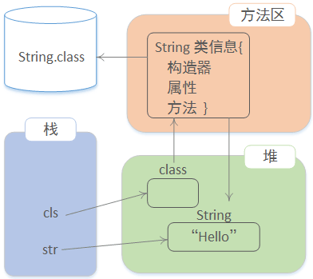
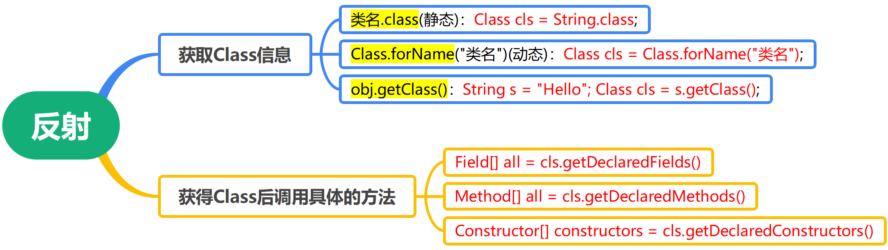

# 概念

> Java 反射机制是在运行状态中，对于任意一个**类**，都能够知道这个类的所有属性和方法；对于任意一个**对象**，都能够调用它的任意一个方法和属性。
>
> 这种动态获取的信息以及动态调用对象的方法的功能称为 Java 语言的反射机制。

Java 反射机制是==在运行状态中==

- 对于任意一个`类`，都能够知道这个类的所有`属性`和`方法`；
- 对于任意一个`对象`，都能够调用这个对象的所有`属性`和`方法`。

这种动态获取信息以及动态调用对象的功能称为 Java 语言的反射机制。即，通过反射，可以获取任何有关它的信息。

一般情况下，使用某个类时必定知道它是什么类，是用来做什么的。于是直接对这个类进行实例化，之后使用这个类对象进行操作：
```java
Apple apple = new Apple(); // 直接初始化
apple.setPrice(4);
```

而反射则是一开始并不知道要初始化的类对象是什么，自然也无法使用 new 关键字来创建对象了：
```java
// 获取类的 Class 对象实例
Class clz = Class.forName("com.reflect.Apple");

// 根据 Class 对象实例获取 Constructor 对象
Constructor constructor = clz.getConstructor();

// 使用 Constructor 对象的 newInstance 方法获取反射类对象
Object object = constructor.newInstance();

// 获取方法的 Method 对象
Method method = clz.getMethod("setPrice", int.class);
// 利用 invoke 方法调用方法
method.invoke(object, 4);
```

上面两段代码的执行结果，其实是完全一样的，但是其思路完全不一样。<font color=red>第一段代码在未运行时就已经确定了要运行的类（Apple），而第二段代码则是在运行时通过字符串值才得知要运行的类（com.reflect.Apple）</font>。

<font color=red>所以，反射就是在运行时才知道要操作的类是什么，并且可以在运行时获取类的完整构造，并调用对应的方法。</font>


## Class类

JVM 为每个加载的 class 及 interface 创建了对应的`Class实例`来保存 class 及 interface 的**所有信息**！获取一个 class 对应的`Class实例`后，就可以获取该class的所有信息！

`class`是由 JVM 在执行过程中动态加载的。JVM 在第一次读取到一种`class类型`时，将其加载进内存。

每加载一种`class`，JVM 就为其创建一个`Class类型`的实例，并关联起来。注意：这里的`Class类型`是一个名叫`Class`的`class`：
```java
public final class Class {
    private Class() {}
}
```

以`String类`为例，当 JVM 加载 String类 时，它首先读取`String.class`文件到内存，然后，为 String类 创建一个`Class实例`并关联起来：
```java
Class cls = new Class(String);
```

这个 Class 实例是 JVM 内部创建的，Class类的构造方法是`private`，只有 JVM 能创建 Class 实例，自己的 Java 程序是无法创建 Class 实例的。

由于 JVM 为每个加载的`class`创建了对应的`Class实例`，并在实例中保存了该 class 的所有信息，包括类名、包名、父类、实现的接口、所有方法、字段等，因此，如果获取了某个`Class实例`，就可以通过这个Class实例获取到该`实例对应的class的所有信息`。


## 使用反射的意义

- 增加程序的灵活性，避免将程序写死到代码里。
  - 定义了一个接口，实现这个接口的类有 20 个，程序里用到了这个实现类的地方有很多地方。如果不使用配置文件，而是手写的话，但需要修改代码时，代码的改动量很大，因为每个地方都要改而且不容易定位。
  - 但是，如果在编写之前先将接口与实现类写在配置文件里，下次只需改配置文件，利用反射（Java API 已经封装好了，直接用就可以用`Class.newInstance()`）就可完成。
- 代码简洁，提高代码的复用率，外部调用方便。
- 对于任意一个类，都能够知道这个类的所有属性和方法；对于任意一个对象，都能够调用它的任意一个方法，获取其属性。

实例：

```java
package reflection.testdemo;
 
interface Fruit { // 水果接口
　 public void eat() ; // 吃水果
}
 
class Apple implements Fruit{ // 定义苹果
　　public void eat() {
　　　　System.out.println("吃苹果。"); 
　　} 
}
 
class Orange implements Fruit{
　　public void eat() {
　　　　System.out.println("吃橘子。"); 
　　}
}
 
class Factory{
　　public static Fruit getInstance(String className){
　　　　Fruit fruit = null ;
　　　　try{
　　　　　　fruit = (Fruit) Class.forName(className).newInstance() ;
　　　　}catch(Exception e ){
　　　　　　e.printStackTrace() ;
　　　　}
　　　　return fruit ;
　 }
}
 
public class FactoryDemo{
　　public static void main(String args[]){
　　// 通过工厂类取得接口实例，传入完整的包.类名称
　　　　Fruit fruit = Factory.getInstance("reflection.testdemo.Apple") ;
　　　　if(fruit != null){ // 判断是否取得接口实例
　　　　　　fruit.eat() ;
　　　　}
　 }
}
```

如果不用反射，那么如果再加一个西瓜类，就得在`Factory`里判断，每添加一个类都要修改一次`Factory`。但用了反射，只用在调用的时候传入完整的类名就可完成。

## 动态加载类到方法区

动态：运行期间动态绑定执行规则。

静态：编译以后就已经确定的执行过程。

JVM 在执行 Java 程序的时候，并不是一次性把所有用到的 class 全部加载到内存，而是第一次需要用到 class 时才加载：
```java
public class Main {
    public static void main(String[] args) {
        if (args.length > 0) {
            create(args[0]);
        }
    }

    static void create(String name) {
        Person p = new Person(name);
    }
}
```

当执行`Main.java`时，由于用到了 Main，因此，JVM 首先会把`Main.class`加载到内存。然而，并不会加载`Person.class`，除非程序执行到`create()`方法，JVM 发现需要加载 Person类 时，才会首次加载 Person.class。如果没有执行 create()方法，那么 Person.class 根本就不会被加载。

这就是 JVM `动态加载class`的特性。利用 JVM 动态加载 class 的特性，才能`在运行期`根据条件加载不同的实现类。

## 创建对象过程

```java
public void test() {
    String str = new String("Hello");
    Class cls = String.class;
    // 动态获取 String类型 的方法信息：
    Method[] all = cls.getDeclaredMethods();
    // Method 代表方法的信息
    // method.getName 可以获取方法的名称
    for (Method method : all) {
        System.out.println(method.getName());
    }
}
```

- Java 将类加载到方法区（自动完成）

- 利用类创建对象。内存中有一个String对象，方法区中还有类的信息！通过Class对象可以获取类的相关信息。




# 动态获取类的信息



Java 有 3 种方法可以获取 Class 信息

* `类名.class` 获取类信息（静态）
  * 直接通过一个`class`的静态变量`class`获取：`Class cls = String.class;`。
* `Class.forName("类名")` 获取类信息 (动态)
  * 如果知道一个`class`的完整类名，可以通过静态方法`Class.forName()`获取：`Class cls = Class.forName("类名");`。
* `obj.getClass()` 获取类信息。运行期间，通过当前对象获取类信息
  * 如果有一个实例变量，可以通过该实例变量提供的`getClass()`方法获取：`String s = "Hello"; Class cls = s.getClass();`。

因为`Class实例`在 JVM中 是`唯一`的，所以，上述方法获取的 Class实例 是同一个实例。可以用`==`比较两个Class实例：
```java
Class cls1 = String.class;

String s = "Hello";
Class cls2 = s.getClass();

boolean sameClass = cls1 == cls2; // true
```

获得 Class 后，可以调用具体的方法：

- 访问字段：通过 Field 实例可以获取字段信息 getName()，getType()，getModifiers()；通过 Field 实例可以读取或设置某个对象的字段，如果存在访问限制，要首先调用 setAccessible(true) 来访问非 public 字段；通过反射读写字段是一种非常规方法，它会破坏对象的封装。
	- `Field getField(name)`：根据字段名获取某个 public 的 field（包括父类）；
	- `Field getDeclaredField(name)`：根据字段名获取当前类的某个 field（不包括父类）；
	- `Field[] getFields()`：获取所有 public 的 field（包括父类）；
	- `Field[] getDeclaredFields()`：获取当前类的所有 field（不包括父类）。

- 调用方法：通过 Metho d实例可以获取方法信息：getName()，getReturnType()，getParameterTypes()，getModifiers()；可以调用某个对象的方法：`Object invoke(Object instance, Object... parameters)`；通过设置`setAccessible(true)`来访问非public方法；通过反射调用方法时，仍然遵循多态原则。
	- `Method getMethod(name, Class...)`：获取某个 public 的 Method（包括父类）；
	- `Method getDeclaredMethod(name, Class...)`：获取当前类的某个 Method（不包括父类）；
	- `Method[] getMethods()`：获取所有 public 的 Method（包括父类）；
	- `Method[] getDeclaredMethods()`：获取当前类的所有 Method（不包括父类）。 
- 调用构造方法，通过反射来创建新的实例：`Person person = Person.class.newInstance()`
	- `getConstructor(Class...)`：获取某个 public 的 Constructor；
	- `getDeclaredConstructor(Class...)`：获取某个 Constructor；
	- `getConstructors()`：获取所有 public 的 Constructor；
	- `getDeclaredConstructors()`：获取所有 Constructor。


## 动态获取类的属性信息和属性值并设置

### 动态获取类的属性信息

```java
public class Main {
    public static void main(String[] args) throws Exception {
        Class stdClass = Student.class;
        // 获取 public 字段 "score":
        System.out.println(stdClass.getField("score"));
	
        // 获取继承的 public 字段 "name":
        System.out.println(stdClass.getField("name"));
	
        // 获取 private 字段 "grade":
        System.out.println(stdClass.getDeclaredField("grade"));
    }
}

class Student extends Person {
    public int score;
    private int grade;
}

class Person {
    public String name;
}
```

上述代码首先获取 Student 的 Class 实例，然后，分别获取 public 字段、继承的 public 字段以及 private 字段：
```java
public int Student.score
public java.lang.String Person.name
private int Student.grade
```

一个 Field 对象包含了一个字段的所有信息：

- `getName()`：返回字段名称，例如，"name"；
- `getType()`：返回字段类型，也是一个Class实例，例如，String.class；
- `getModifiers()`：返回字段的修饰符，它是一个 int，不同的 bit 表示不同的含义。

以 String 类的 value 字段为例：
```java
public final class String {
    private final byte[] value;
}
```

用反射获取该字段的信息：
```java
Field field = String.class.getDeclaredField("value");
field.getName(); // "value"
field.getType(); // class [B 表示byte[]类型

int modify = field.getModifiers();
Modifier.isFinal(modify); // true
Modifier.isPublic(modify); // false
Modifier.isProtected(modify); // false
Modifier.isPrivate(modify); // true
Modifier.isStatic(modify); // false
```


获取方法（`getDeclaredFields`）：

```java
// 动态加载类
Class cls = Class.forName(className);
// 动态获取类声明的属性信息
Field[] all = cls.getDeclaredFields();
```

实例：

```java
package class_information;

import java.lang.reflect.Field;

/**
 * 动态获取类的属性信息
 *
 * @author chenzufeng
 */
public class Eoo {
    int id;
    String name;
    double salary;

    public Eoo() {}

    public Eoo(int id, String name, double salary) {
        super();
        this.id = id;
        this.name = name;
        this.salary = salary;
    }

    /**
     * 动态获取一个类的全部属性信息
     * 1. 动态加载一个类到方法区
     * 2. 动态获取类的属性信息
     */
    public static void getClassFields() throws ClassNotFoundException {
        String className = "class_information.Eoo";
        // 动态加载类
        Class cls = Class.forName(className);
        // 动态获取类声明的属性信息
        Field[] fields = cls.getDeclaredFields();
        for (Field field : fields) {
            // getName获取属性的名字
            System.out.println(field.getName());
        }
    }

    public static void main(String[] args) throws ClassNotFoundException {
        getClassFields();
    }
}
```

输出结果：

```
id
name
salary
```


### 获取字段值

实现过程（如何利用反射API实现动态属性访问）：

1. 找到对象的类型信息（方法区）；

2. 在信息中找属性信息（Field）；

3. 在对象上获取属性的值！

```java
package attribute_value;

import java.lang.reflect.Field;

/**
 * 动态获取类的属性值
 * @author chenzufeng
 */
public class Goo {
    public int id;
    public String name;

    public Goo() {}

    public Goo(int id, String name) {
        super();
        this.id = id;
        this.name = name;
    }

    /**
     * 获取obj对象的 fieldName对应属性的值
     * @param object 对象
     * @param filedName 属性
     * @return 属性值
     */
    public Object getAttributeValue(Object object, String filedName) {
        try {
            /*
             * 1. 获取类信息：找到对象的类型信息
             *
             * Java有3种方法可以获取Class信息
             * a) 类名.class获取类信息(静态)
             * b) Class.forName("类名") 获取类信息 (动态)
             * c) obj.getClass()获取类信息。运行期间，通过当前对象获取类信息
             */
            Class cls = object.getClass();

            /*
             * 2. 找到属性：在信息中找属性信息
             *
             * getDeclaredField 按照属性名在cls中查找类信息。
             * 当属性没有找到时候，抛出异常！
             */
            Field field = cls.getDeclaredField(filedName);

            /*
             * 3. 在对象上获取属性的值
             * get方法：在一个对象上获取属性的值，对象上没有对应的属性，抛出异常
             */
            Object value = field.get(object);

            return value;

        } catch (NoSuchFieldException | IllegalAccessException e) {
            e.printStackTrace();
        }

        return null;
    }

    public static void testGetAttributeValue() {
        Goo goo = new Goo(1, "Tom");
        Object id = goo.getAttributeValue(goo, "id");
        Object name = goo.getAttributeValue(goo, "name");
        System.out.println(id + " " + name);
    }

    public static void main(String[] args) {
        testGetAttributeValue(); // 1 Tom
    }
}
```

#### Field.setAccessible(true)

利用反射拿到字段的一个 Field 实例只是第一步，还可以拿到一个实例对应的该字段的值。

例如，对于一个 Person 实例，可以先拿到 name 字段对应的 Field，再获取这个实例的 name 字段的值：
```java
public class Main {

    public static void main(String[] args) throws Exception {
        Object person = new Person("Xiao Ming");
	
	// 获取 Class 实例
        Class cls = person.getClass();
	
	// 获取 Field 实例
        Field field = cls.getDeclaredField("name");
	
	// 获取指定实例的指定字段的值
        Object value = field.get(person);
	
        System.out.println(value); // "Xiao Ming"
    }
}

class Person {
    private String name;

    public Person(String name) {
        this.name = name;
    }
}
```

上述代码先获取 Class 实例，再获取 Field 实例，然后，用`Field.get(Object)`获取指定实例的指定字段的值。

运行代码，如果不出意外，会得到一个`IllegalAccessException`，这是因为 name 被定义为一个 private 字段，正常情况下，Main 类无法访问 Person 类的 private 字段。要修复错误，可以将 private 改为 public，或者，在调用`Object value = f.get(p);`前，先写一句：
```java
field.setAccessible(true);
```

调用`Field.setAccessible(true)`的意思是，别管这个字段是不是 public，一律允许访问。


如果使用反射可以获取 private 字段的值，那么类的封装还有什么意义？

答案是正常情况下，总是通过`person.name`来访问 Person 的 name 字段，编译器会根据 public、protected 和 private 决定是否允许访问字段，这样就达到了数据封装的目的。

而反射是一种非常规的用法，使用反射，首先代码非常繁琐，其次，它更多地是给工具或者底层框架来使用，目的是在不知道目标实例任何信息的情况下，获取特定字段的值。

此外，`setAccessible(true)`可能会失败。

如果 JVM 运行期存在`SecurityManager`，那么它会根据规则进行检查，有可能阻止 setAccessible(true)。例如，某个 SecurityManager 可能不允许对 java 和 javax 开头的 package 的类调用 setAccessible(true)，这样可以保证 JVM 核心库的安全。

### 设置字段值

设置字段值是通过`Field.set(Object, Object)`实现的，其中第一个 Object 参数是指定的实例，第二个 Object 参数是待修改的值：
```java
public class Main {

    public static void main(String[] args) throws Exception {
        Person person = new Person("Xiao Ming");
	System.out.println(p.getName()); // "Xiao Ming"
	
        Class cls = person.getClass();
        Field field = cls.getDeclaredField("name");
	
	// 修改非 public 字段，需要首先调用 setAccessible(true)
        field.setAccessible(true);
	
        field.set(person, "Xiao Hong");
        System.out.println(person.getName()); // "Xiao Hong"
    }
}

class Person {
    private String name;

    public Person(String name) {
        this.name = name;
    }

    public String getName() {
        return this.name;
    }
}
```

## 动态获取类的方法信息并调用类的方法

### 动态获取类的方法信息

```java
public class Main {
    public static void main(String[] args) throws Exception {
        Class stdClass = Student.class;
	
        // 获取 public 方法getScore，参数为 String:
        System.out.println(stdClass.getMethod("getScore", String.class));
	
        // 获取继承的 public 方法 getName，无参数:
        System.out.println(stdClass.getMethod("getName"));
	
        // 获取 private 方法 getGrade，参数为 int:
        System.out.println(stdClass.getDeclaredMethod("getGrade", int.class));
    }
}

class Student extends Person {
    public int getScore(String type) {
        return 99;
    }
    private int getGrade(int year) {
        return 1;
    }
}

class Person {
    public String getName() {
        return "Person";
    }
}
```

输出结果：
```markdown
public int Student.getScore(java.lang.String)
public java.lang.String Person.getName()
private int Student.getGrade(int)
```

一个 Method 对象包含一个方法的所有信息：

- `getName()`：返回方法名称，例如："getScore"；
- `getReturnType()`：返回方法返回值类型，也是一个 Class实例，例如：String.class；
- `getParameterTypes()`：返回方法的参数类型，是一个 Class数组，例如：{String.class, int.class}；
- `getModifiers()`：返回方法的修饰符，它是一个 int，不同的 bit 表示不同的含义。

获取方法（`getDeclaredMethods`）：

```java
// 动态加载类
Class cls = Class.forName(className);
// 动态获取类的方法信息
Method[] all = cls.getDeclaredMethods();
```

实例：

```java
package class_information;

import java.lang.reflect.Method;

/**
 * 动态获取类的方法信息
 * getDeclaredMethods
 *
 * 类的全名：class_information.Foo
 * 编译后：class_information.Foo.class
 * @author chenzufeng
 */
public class Foo {
    public int test() {
        return 5;
    }

    public double test1() {
        return 5d;
    }

    public static void main(String[] args) {
        getClassMethod();
    }

    /**
     * 动态的加载类信息到方法区，并且返回对应的Class对象！
     * Class对象可以访问类的全部信息！
     *
     * 将className对应的类文件，从磁盘中加载到内存方法区，返回这个类的信息
     */
    public static void getClassMethod() {
        String className = "class_information.Foo";
        try {
            // 动态加载类
            Class cls = Class.forName(className);
            // 动态获取类的方法信息
            Method[] all = cls.getDeclaredMethods();
            for (Method method : all) {
                System.out.println(method.getName());
            }
        } catch (ClassNotFoundException e) {
            e.printStackTrace();
        }
    }
}
```

输出结果：

```
main
test
getClassMethod
test1
```


### 调用方法

```java
package class_method;

import java.lang.reflect.InvocationTargetException;
import java.lang.reflect.Method;
import java.util.ArrayList;
import java.util.List;

/**
 * 动态调用类的方法
 * @author chenzufeng
 */
public class InvokeClassMethod {
    public static void main(String[] args) throws
            NoSuchMethodException, InvocationTargetException, IllegalAccessException {
        List<String> list = new ArrayList<>();
        list.add("Tom");
        list.add("Jack");

        // 1. 动态获取类信息
        Class cls = list.getClass();

        // 2. 通过[方法名]和[参数类型]找到对应的方法
        Method method = cls.getDeclaredMethod("remove", new Class[] {int.class});

        // 3. 调用方法，传递对象和具体参数
        Object value = method.invoke(list, new Object[] {0});

        System.out.println(value);  // Tom
    }
}
```

### 调用静态方法

如果获取到的 Method 表示一个静态方法，调用静态方法时，由于无需指定实例对象，所以 invoke 方法传入的第一个参数永远为 null。以`Integer.parseInt(String)`为例：
```java
public class Main {
    public static void main(String[] args) throws Exception {
        // 获取Integer.parseInt(String)方法，参数为String:
        Method m = Integer.class.getMethod("parseInt", String.class);
        // 调用该静态方法并获取结果:
        Integer n = (Integer) m.invoke(null, "12345");
        // 打印调用结果:
        System.out.println(n);
    }
}
```

### 调用非public方法

对于`非public方法`，虽然可以通过`Class.getDeclaredMethod()`获取该方法实例，但直接对其调用将得到一个`IllegalAccessException`。为了调用非public方法，通过`Method.setAccessible(true)`允许其调用：
```java
public class Main {
    public static void main(String[] args) throws Exception {
        Person person = new Person();
        Method method = person.getClass().getDeclaredMethod("setName", String.class);
        method.setAccessible(true);
        method.invoke(person, "Bob");
        System.out.println(person.name);
    }
}

class Person {
    String name;
    private void setName(String name) {
        this.name = name;
    }
}
```

此外，setAccessible(true) 可能会失败。如果 JVM 运行期存在`SecurityManager`，那么它会根据规则进行检查，有可能阻止 setAccessible(true)。例如，某个 SecurityManager 可能不允许对 java 和 javax 开头的 package 的类调用 setAccessible(true)，这样可以保证 JVM 核心库的安全。

### 多态

一个 Person 类定义了 hello() 方法，并且它的子类 Studen t也覆写了 hello() 方法，那么，从`Person.class`获取的 Method，作用于 Student 实例时，调用的方法到底是哪个？
```java
public class Main {
    public static void main(String[] args) throws Exception {
        // 获取 Person 的 hello 方法:
        Method hello = Person.class.getMethod("hello");
        // 对 Student 实例调用 hello 方法:
        hello.invoke(new Student());
    }
}

class Person {
    public void hello() {
        System.out.println("Person:hello");
    }
}

class Student extends Person {
    public void hello() {
        System.out.println("Student:hello");
    }
}
```

运行上述代码，发现打印出的是`Student:hello`，因此，使用反射调用方法时，仍然遵循多态原则：即<font color=red>总是调用实际类型的覆写方法（如果存在）</font>。

上述的反射代码：
```java
Method method = Person.class.getMethod("hello");
method.invoke(new Student());
```

实际上相当于：
```java
Person person = new Student();
person.hello();
```


## 动态获取类的构造器信息

获取方法：

```java
// 动态加载类
Class cls = Class.forName(className);
// 动态获取类的构造器信息
Constructor[] constructors = cls.getDeclaredConstructors();
```

实例：

```java
/**
 * 动态获取类的构造器信息
 */
public static void getAllConstructors() throws ClassNotFoundException {
    String className = "class_information.Eoo";
    // 动态加载类
    Class cls = Class.forName(className);
	 // 动态获取类的构造器信息
    Constructor[] constructors = cls.getDeclaredConstructors();
    for (Constructor constructor : constructors) {
        System.out.print(constructor.getName());
        /*
         * 获取构造器的参数类型列表
         * Parameter参数；Type类型
         * Class[] 代表所有参数的类型列表
         */
        Class[] types = constructor.getParameterTypes();
        System.out.println(Arrays.toString(types));
    }
}
```

输出结果：

```
class_information.Eoo[]
class_information.Eoo[int, class java.lang.String, double]
```

通过 Constructor 实例可以创建一个实例对象：`newInstance(Object... parameters)`； 通过设置`setAccessible(true)`来访问`非public构造方法`。

# 动态创建对象

## 调用无参构造器创建对象

```java
// 动态加载类：java.lang.ClassNotFoundException
Class cls = Class.forName(className);
// cls.newInstance()调用无参数构造器创建对象
Object obj = cls.newInstance();
```


- 如果没有无参数构造器，将发生异常！

- `Class`提供了方法`newInstance()`。

```java
package create_object;

import java.util.Date;

/**
 * 调用无参构造器创建对象
 * @author chenzufeng
 */
public class UseConstructorWithoutParameter {
    public static void main(String[] args) throws Exception {
        createObject();
    }

    /**
     * 动态调用无参数构造器创建对象
     * 1.动态加载类
     * 2.利用class的方法newInstance创建对象
     *
     * 注意：对象所属类必须有无参数，否则出异常
     */
    public static void createObject() throws
            ClassNotFoundException, IllegalAccessException, InstantiationException {
        String className = "java.util.Date";
        Class cls = Class.forName(className);
        // cls.newInstance()调用无参数构造器创建对象
        Object object = cls.newInstance();
        System.out.println("动态的创建对象：");
        System.out.println(object);

        // 静态的创建对象！编译已经就固定了！
        Date date = new Date();
        System.out.println("静态的创建对象：");
        System.out.println(date);
    }
}
```

输出结果：

```
动态的创建对象：
Sun Feb 07 21:18:50 CST 2021
静态的创建对象：
Sun Feb 07 21:18:50 CST 2021
```


## 调用有参构造器创建对象

```java
// 动态加载类
Class cls = Class.forName(className);
// 动态获取指定参数类型的构造器
Constructor constructor = cls.getDeclaredConstructor(paramTypes);
// 执行构造器constructor.newInstance()方法，创建对象
Object obj = constructor.newInstance(params);
```


如果没有对应有参数构造器！将发生异常！参数传递错误、将发生异常！

```java
package create_object;


import java.lang.reflect.Constructor;
import java.lang.reflect.InvocationTargetException;

/**
 * 调用有参构造器创建对象
 * @author chenzufeng
 */
public class UseConstructorWithParameter {

    public static void main(String[] args) {
        testCreateObject();
    }

    /**
     * 调用有参构造器创建对象：className + paramTypes共同决定调用哪个构造器！
     * @param className 调用className对应类的有参数构造器
     * @param paramTypes 代表对应构造器的参数列表
     * @param params 执行构造器还需要具体的参数params，为构造器参数列表赋值
     * @return 创建的对象
     */
    public static Object createObject(String className, Class[] paramTypes, Object[] params) {
        try {
            // 1.动态加载类
            Class cls = Class.forName(className);
            // 2.动态获取指定参数类型的构造器
            Constructor constructor = cls.getDeclaredConstructor(paramTypes);
            // 3.执行构造器newInstance()方法，创建对象
            Object object = constructor.newInstance(params);

            return object;

        } catch (ClassNotFoundException | NoSuchMethodException e) {
            e.printStackTrace();
        } catch (IllegalAccessException | InstantiationException | InvocationTargetException e) {
            e.printStackTrace();
        }

        return null;
    }

    /**
     * 调用有参构造器创建对象
     * new Date(long date)
     * new String("Hello")
     * new String(byte[],"utf-8");
     */
    public static void testCreateObject() {
        /*
         * 动态调用 new Date(long date);
         */
        String className = "java.util.Date";
        // paramTypes类型列表：Class类型的数组
        Class[] paramTypes = {long.class};
        // 实际参数列表：params
        Object[] params = {1000L*60*60*24*365};

        Object object = createObject(className, paramTypes, params);
        System.out.println(object);

        /*
         * 动态调用 new String("Hello");
         * {} 只能用在声明变量时候直接初始化，不能用于赋值语句！
         * 赋值语句可以使用 new Object[]{"Hello"}
         */
        className = "java.lang.String";
        paramTypes = new Class[] {String.class};
        params = new Object[] {"Hello"};

        object = createObject(className, paramTypes, params);
        System.out.println(object);

        /*
         * 动态调用 new String(byte[],"utf-8");
         */
        object = createObject("java.lang.String",
                new Class[] {byte[].class, String.class},
                new Object[] {new byte[] {65, 66, 67, 68}, "UTF-8"});
        System.out.println(object);
    }
}
```

输出结果：

```
Fri Jan 01 08:00:00 CST 1971
Hello
ABCD
```


# 参考资料

[Java 反射机制 | MrBird](https://mrbird.cc/Java-反射机制.html)

[反射 | 廖雪峰](https://www.liaoxuefeng.com/wiki/1252599548343744/1255945147512512)
